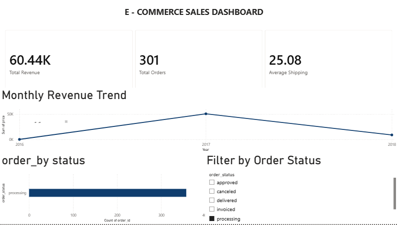

# 📊 InsightOS – E-Commerce Sales Analytics Dashboard

> An end-to-end Business Intelligence and Data Analytics project built using Python, SQL, SQLite, and Power BI to analyze e-commerce sales data and generate actionable business insights.

---

# 🚀 Project Overview

**InsightOS** is an end-to-end e-commerce analytics project built to analyze sales and operational performance using **Python, SQL, SQLite, and Power BI**.

The project transforms raw transactional data into a structured analytical dataset, calculates business KPIs, and presents the results through an interactive Power BI dashboard.

The analysis focuses on:

* Revenue and order performance
* Order fulfillment status
* Product category contribution
* Seller performance
* Average order value
* Shipping cost patterns

The project demonstrates a complete **Data Analytics and Business Intelligence workflow**, from data preparation and exploratory analysis to SQL-based analysis, KPI development, dashboard creation, and business insight generation.

# 🎯 Business Questions

InsightOS was designed to help business stakeholders answer the following questions:

* **Revenue:** How is revenue performing over time, and are there meaningful changes in year-over-year performance?
* **Orders:** How is order volume changing over time?
* **Order Fulfillment:** What proportion of orders are delivered, shipped, processing, cancelled, or approved?
* **Product Categories:** Which product categories contribute the most to total revenue?
* **Seller Performance:** Which sellers generate the highest revenue?
* **Order Economics:** What is the average revenue generated per order?
* **Shipping:** What is the average shipping cost, and where is shipping cost most concentrated?
* **Performance Monitoring:** Which KPIs should management monitor regularly to evaluate sales and operational performance?


---

## 📊 Dashboard Preview


The interactive Power BI dashboard provides an overview of e-commerce sales, order fulfillment, seller performance, product categories, and shipping costs.




---

# 📈 Key Performance Indicators (KPIs)

- 💰 Total Revenue
- 📦 Total Orders
- 🚚 Average Shipping Cost
- 📈 Revenue Trend
- 📋 Orders by Status

---

# 🔍 Business Insights

The analysis of 301 orders generated **₹60.40K in total revenue**, with an average order value of **₹200.66**.

* **Revenue Performance:** Total revenue reached **₹60.40K**, with revenue increasing **28.6% compared with the previous year**.
* **Order Performance:** The dashboard recorded **301 total orders**, representing a **19.5% increase compared with the previous year**.
* **Order Fulfillment:** **132 orders (43.9%)** were delivered, while **74 (24.6%)** were shipped, **48 (15.9%)** were processing, **30 (10.0%)** were cancelled, and **17 (5.6%)** were approved.
* **Product Mix:** Electronics generated the highest category revenue at approximately **₹18.7K (31.0%)**, followed by clothing at **₹14.2K (23.5%)**.
* **Seller Performance:** The top-performing seller generated approximately **₹2.68K** in revenue, while the top 10 sellers contributed a combined **₹17.94K**.
* **Shipping Efficiency:** Average shipping cost was **₹25.08**, with the **₹20–₹30 shipping-cost range accounting for 76 orders**, the largest concentration in the distribution.
* **Order Value:** Average order value increased **7.6% compared with the previous year**, indicating growth in revenue generated per order.

---

# 🛠 Tech Stack

| Category | Tools |
|----------|-------|
| Programming | Python |
| Data Analysis | Pandas |
| Database | SQLite |
| Visualization | Plotly |
| Dashboard | Power BI |
| IDE | VS Code |
| Version Control | Git & GitHub |

---

# 📂 Project Structure

```text
InsightOS/
│
├── data/
│   ├── raw/
│   ├── ecommerce.db
│
├── notebooks/
│   ├── 01_data_exploration.ipynb
│   ├── 02_sales_analytics.ipynb
│   ├── 03_visualization.ipynb
│   ├── 04_sql_database.ipynb
│   └── 05_export_for_powerbi.ipynb
│
├── reports/
│   └── InsightOS_Dashboard.pbix
│
├── src/
│   └── kpi_engine.py
│
├── requirements.txt
│
└── README.md
```

---

# 🔄 Data & Analytics Workflow

InsightOS follows an end-to-end analytics workflow that transforms raw transactional data into business insights.

```text
Raw E-Commerce Data
        │
        ▼
Data Cleaning & Transformation
        │
        │  Python • Pandas
        ▼
Exploratory Data Analysis
        │
        │  Trends • Distributions • Data Quality
        ▼
SQL-Based Data Analysis
        │
        │  SQLite • Business Queries
        ▼
KPI & Metric Generation
        │
        │  Revenue • Orders • AOV • Shipping Cost
        ▼
Power BI Dashboard
        │
        │  Interactive Visualizations • Filters
        ▼
Business Insights
        │
        ▼
Data-Driven Decision Support
```

### Workflow Breakdown

**1. Data Preparation**
Cleaned and transformed raw e-commerce data using Python and Pandas to prepare it for analysis.

**2. Exploratory Data Analysis**
Analyzed transaction patterns, revenue trends, order status, shipping costs, seller performance, and product categories.

**3. SQL Analysis**
Structured the cleaned dataset in SQLite and used SQL queries to calculate business metrics and analyze operational performance.

**4. KPI Development**
Generated key performance indicators including total revenue, total orders, average order value, and average shipping cost.

**5. Dashboard Development**
Built an interactive Power BI dashboard with KPI cards, trend analysis, order-status distribution, seller performance, product-category analysis, and shipping-cost distribution.

**6. Business Insights**
Translated analytical findings into measurable business insights that can support sales and operational performance monitoring.

---
# 🛠 Tech Stack

| Category                        | Tools & Technologies      |
| ------------------------------- | ------------------------- |
| **Programming & Data Analysis** | Python, Pandas            |
| **Database & Querying**         | SQL, SQLite               |
| **Data Visualization**          | Plotly, Power BI          |
| **Development Environment**     | Jupyter Notebook, VS Code |
| **Version Control**             | Git, GitHub               |


# 📂 Project Structure

```text
InsightOS/
│
├── data/
│   ├── raw/                    # Raw e-commerce datasets
│   └── ecommerce.db            # SQLite analytical database
│
├── notebooks/
│   ├── 01_data_exploration.ipynb
│   ├── 02_sales_analytics.ipynb
│   ├── 03_visualization.ipynb
│   ├── 04_sql_database.ipynb
│   └── 05_export_for_powerbi.ipynb
│
├── reports/
│   └── InsightOS_Dashboard.pbix
│
├── src/
│   └── kpi_engine.py           # KPI calculation logic
│
├── requirements.txt
├── image.png                   # Dashboard preview
└── README.md
```

### Directory Overview

* **`data/`** — Contains the raw datasets and SQLite database used for analysis.
* **`notebooks/`** — Contains the analysis workflow, including data exploration, sales analysis, visualization, SQL processing, and Power BI preparation.
* **`reports/`** — Contains the final Power BI dashboard.
* **`src/`** — Contains reusable Python code for KPI calculations.
* **`requirements.txt`** — Lists the Python dependencies required to run the analysis.
* **`image.png`** — Dashboard preview display

# ▶️ How to Run

### 1. Clone the Repository

```bash
git clone https://github.com/Snehachatrath19/InsightOS.git
cd InsightOS
```

### 2. Install Dependencies

```bash
pip install -r requirements.txt
```

### 3. Run the Analysis

Open the notebooks in the `notebooks/` directory and run them in sequence:

```text
01_data_exploration.ipynb
        ↓
02_sales_analytics.ipynb
        ↓
03_visualization.ipynb
        ↓
04_sql_database.ipynb
        ↓
05_export_for_powerbi.ipynb
```

### 4. Explore the Dashboard

Open:

```text
reports/InsightOS_Dashboard.pbix
```

in Microsoft Power BI Desktop to interact with the dashboard.

# 📊 Dashboard Features

The InsightOS Power BI dashboard provides an interactive view of e-commerce sales and operational performance.

### KPI Monitoring

* **Total Revenue:** ₹60.40K
* **Total Orders:** 301
* **Average Order Value:** ₹200.66
* **Average Shipping Cost:** ₹25.08

### Interactive Analysis

* **Revenue Trend:** Track revenue performance across the analysis period.
* **Order Status:** Monitor delivered, shipped, processing, cancelled, and approved orders.
* **Seller Performance:** Compare the top 10 sellers by revenue.
* **Product Category Analysis:** Analyze revenue contribution across electronics, clothing, home & kitchen, beauty, and sports.
* **Monthly Orders:** Identify changes in order volume over time.
* **Shipping Cost Distribution:** Understand the distribution of shipping costs across orders.

# 📊 Dashboard Features

The InsightOS Power BI dashboard provides an interactive view of e-commerce sales and operational performance.

### KPI Monitoring

* **Total Revenue:** ₹60.40K
* **Total Orders:** 301
* **Average Order Value:** ₹200.66
* **Average Shipping Cost:** ₹25.08

### Interactive Analysis

* **Revenue Trend:** Track revenue performance across the analysis period.
* **Order Status:** Monitor delivered, shipped, processing, cancelled, and approved orders.
* **Seller Performance:** Compare the top 10 sellers by revenue.
* **Product Category Analysis:** Analyze revenue contribution across electronics, clothing, home & kitchen, beauty, and sports.
* **Monthly Orders:** Identify changes in order volume over time.
* **Shipping Cost Distribution:** Understand the distribution of shipping costs across orders.

### Dashboard Filters

Users can interactively filter the analysis by:

* Order Status
* Seller
* Year
* Price Range

# 💡 Decision Support

InsightOS converts sales and operational data into measurable indicators that can support business decision-making.

The dashboard enables stakeholders to:

* **Monitor revenue performance** through revenue trends and year-over-year changes.
* **Track order fulfillment** by monitoring the distribution of delivered, shipped, processing, cancelled, and approved orders.
* **Identify high-value product categories** by comparing their contribution to total revenue.
* **Evaluate seller performance** using revenue-based seller comparisons.
* **Monitor order economics** through Average Order Value and total order volume.
* **Assess shipping efficiency** by tracking average shipping cost and its distribution across orders.
* **Use interactive filters** to investigate performance across different years, sellers, order statuses, and price ranges.

# 🎯 Skills Demonstrated

### Data Analytics

* Data Cleaning & Transformation
* Exploratory Data Analysis (EDA)
* Trend & Pattern Analysis
* KPI Development
* Business Metrics Analysis

### SQL & Database

* SQL Querying
* Data Aggregation
* SQLite Database Management
* Business-Oriented Data Analysis

### Business Intelligence

* Power BI Dashboard Development
* Interactive Data Visualization
* KPI Monitoring
* Performance Analysis
* Dashboard-Based Decision Support

### Business Analysis

* Business Question Formulation
* Revenue & Sales Analysis
* Order & Fulfillment Analysis
* Seller Performance Analysis
* Shipping Cost Analysis
* Data-Driven Decision Support

### Technical & Development

* Python
* Pandas
* Plotly
* Git & GitHub


# 👩‍💻 Author

**Sneha Chatrath**

Electrical & Computer Engineering

Aspiring Business Analyst

GitHub: https://github.com/Snehachatrath19
